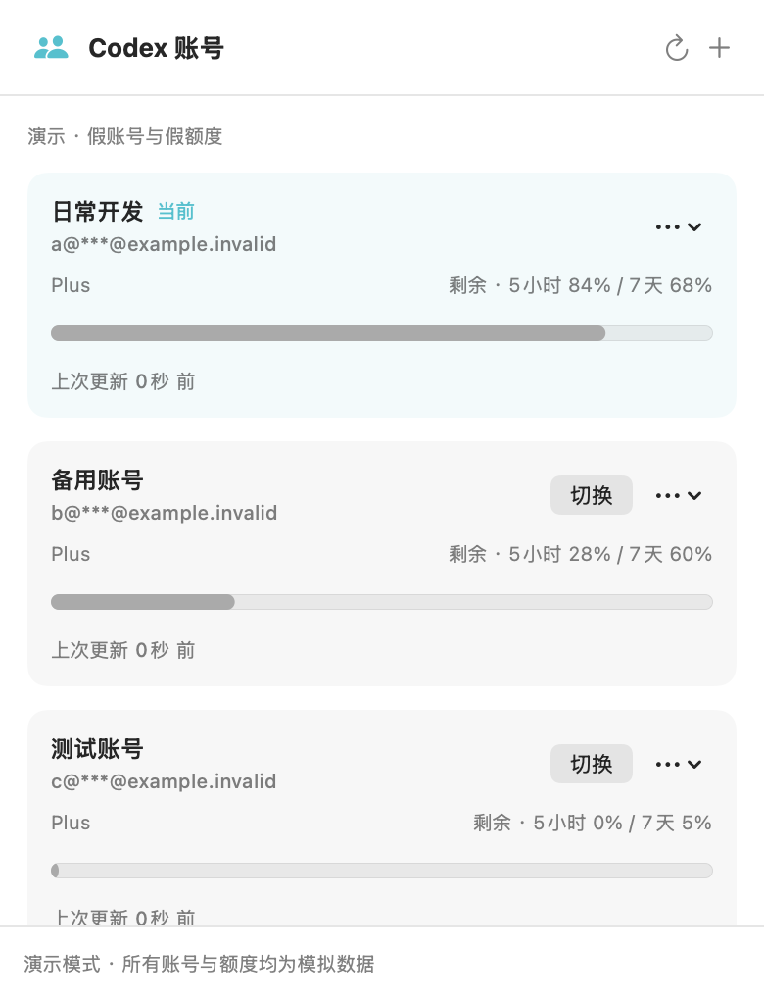

# Codex Account Switcher

English · [简体中文](README.md)

A native macOS menu bar utility for saving multiple Codex accounts, checking usage, and switching accounts after Codex has quit.

**Current version: 0.4.2 candidate.** The GitHub tag `v0.4.2-rc.1` is a pre-release, not a claim of completed real-world acceptance. The application UI is currently in Simplified Chinese.



## Features

- Accounts, plans, quota windows, and switch actions in one menu bar panel.
- Add accounts through OpenAI's official browser login; rename, reauthorize, or remove saved accounts.
- Store credentials in macOS Keychain. Background operations stop when permission is needed instead of prompting for a password.
- Switch after Codex and shared-auth CLI / IDE backends have quit, then reopen Codex automatically.
- Preserve interrupted transactions and credential generations for recovery and redacted diagnostics.

## Download and install

Download these files from [Releases](https://github.com/ru-gong/codex-account-switcher/releases):

- `CodexAccountSwitcher-0.4.2-macOS-arm64.zip`: runnable App and bilingual installation instructions.
- `SHA256SUMS`: artifact integrity checksum.

Place both files in the same directory and run `shasum -a 256 -c SHA256SUMS`. Extract the ZIP, move `CodexAccountSwitcher.app` to Applications, and open it. The app lives in the menu bar and has no Dock window.

This build is **ad-hoc signed, without Developer ID or Apple notarization**. If macOS blocks its first launch, attempt to open it, then use System Settings → Privacy & Security → Open Anyway for this specific app. Do not disable Gatekeeper globally. [Apple's installation guidance](https://support.apple.com/en-us/102445)

Quit the previous switcher before replacing it during an upgrade. The account library is retained. A new build may require another first-launch exception or explicit Keychain authorization.

## Compatibility

| Item | Current scope |
| --- | --- |
| OS / architecture | macOS 14+; downloadable build is Apple Silicon / arm64 only |
| Codex location | `/Applications/Codex.app` |
| Pinned Codex version | `26.908.40834 (8881)` / backend `0.154.0-alpha.6.2`; also `26.903.61454 (8378)` and `26.903.71938 (8576)` / backend `0.153.4` |
| Authentication | Default `~/.codex` directory with file credential storage |
| Unsupported | Other versions, managed authentication, non-default profiles, keyring / auto / ephemeral storage, or overridden authentication gateways |

The switcher checks the Codex version and vendor signature before writing. Usage queries depend on a pinned internal, unstable protocol; Codex upgrades may require new compatibility work. An unknown version shows a persistent compatibility notice and pauses queries and switching.

“额度数据待更新” means the cached result is older than 15 minutes, not that the allowance is exhausted or the login expired. Invalid logins have a separate sign-in message. An explicit backend denial of included usage is displayed without inferring recovery from percentages.

## Usage

1. Choose **保存当前账号** (Save current account), then use `+` to add another account.
2. Usage refreshes automatically every 15 minutes by default. Startup, wake, and opening the menu also check for stale results. You can disable automatic refresh in **更多设置** (More settings); the preference survives relaunch. The top-right button refreshes manually. Each account shows its last update and any failure; equal percentages across plans do not imply equal absolute allowances.
3. If permission is needed, choose **授权此账号** (Authorize this account), enter any password only in the macOS system dialog. Successful approval immediately refreshes that account. Background work never requests approval. An expired login requires signing in again; Keychain approval cannot extend token validity.
4. Quit Codex and shared-auth CLI / IDE processes normally; closing a window is not sufficient. Choose **切换** (Switch) beside the target account.
5. After Codex reopens, verify the actual account and workspace, then choose **我已核对账号与工作区** (I have verified the account and workspace).

**The first switch to an unverified account is still an acceptance workflow.** Normal mode refuses accounts without a recorded continuity check. After preparing recovery materials, explicitly start acceptance mode:

```sh
open -a /Applications/CodexAccountSwitcher.app --args --live-acceptance
```

Quit an already-running switcher first. This flag permits first-time capability testing; **it does not create isolation** and uses the current macOS user's real Codex account library. Check tasks, authenticated browser sites, and Computer History before saving the continuity observation in More settings → **验收工具** (Acceptance tools). These tools are visible only in acceptance mode and record manual observations; they do not monitor or control Computer History.

## Data, privacy, and recovery

- Normal switching replaces only `~/.codex/auth.json` through the transaction engine. It does not replace task databases, browser profiles, memories, or Computer History data.
- Credentials use the `local.codex-account-switcher.credentials.v1` Keychain service. Account metadata, quota, and transactions use `~/Library/Application Support/CodexAccountSwitcher`.
- Previously read immutable credentials are cached in process memory and cleared on sleep or session deactivation. There is no plaintext fallback credential vault.
- Login and usage communicate through the local official Codex backend. Usage queries do not pass refresh tokens to the subprocess, and the switcher does not rotate refresh tokens in the background.
- Interrupted switches are not automatically replayed. Quit Codex before choosing rollback in More settings; the target account's newly refreshed credentials are retained before recovery.
- Rollback concerns authentication, not restoring an entire backup over newer tasks or browser data. The optional backup helper copies local data to an encrypted image only when explicitly run; it is separate from normal switching.

Removing the App retains the account library by default. Remove saved non-current accounts from the UI if desired. See [Privacy](docs/PRIVACY.md) for details.

## Validation and limitations

84 Swift tests passed in both Debug and Release configurations, covering transactions, concurrency, recovery, and noninteractive Keychain behavior. Additional checks cover subprocess crashes, synthetic Keychain items, and packaging requirements.

These checks do not establish full real-account acceptance. Menu interaction, repeated switching, functional restore, a 48-hour observation, and installation on another Mac are not all complete. Computer History continuity remains unverified; uninterrupted History across every account or version is not promised. See [Acceptance status](docs/ACCEPTANCE.md).

## Build and test

Requires Xcode / Swift 6 or newer and Python 3. There are no third-party Swift package dependencies.

```sh
git clone https://github.com/ru-gong/codex-account-switcher.git
cd codex-account-switcher
swift test
swift test -c release
python3 scripts/process_acceptance.py
python3 scripts/test_release_gate.py
zsh scripts/package.sh
```

Outputs are written to `dist/0.4.2/`; existing version directories are never overwritten. For synthetic-only demonstration, run `open -n dist/0.4.2/CodexAccountSwitcher.app --args --demo`.

Packaging remaps build paths, removes debug symbols, and audits artifacts. Follow [Releasing](docs/RELEASING.md) before publishing. Never upload private evidence, account files, backups, or local development history.

## Project status and license

An independent project, not an official OpenAI product. Codex itself is not bundled. No open-source license has been granted yet. See [NOTICE.md](NOTICE.md) for third-party and source notes.
